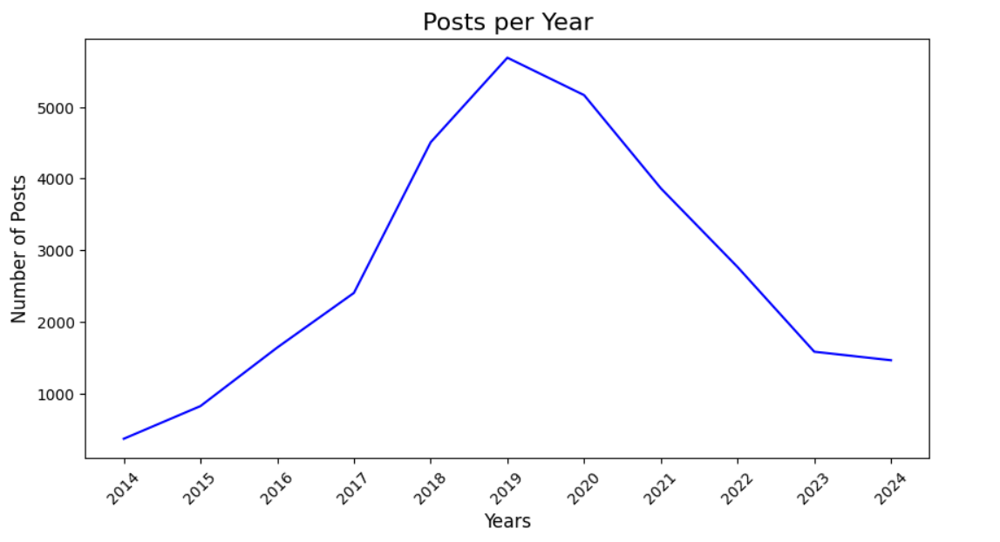

# Popular Data Science Questions

### Intro
In this guided project, we will analyze data from the Stack Exchange Data Science database to identify the most popular topics in data science questions. At the end of the project, we will recommend types of questions to ask based on our findings.

**Scenario:** You're working for a company that creates data science content, be it books, online articles, videos or interactive text-based platforms like Dataquest.

**Objective:** What is it that people want to learn about in data science?

**Data From:** [Data Science Stack Exchange](https://datascience.stackexchange.com/)

View this project live on Google Colab [here](https://colab.research.google.com/drive/1aSw5E6EgqZK55ub7Lv9Nt6X5fGlBmRkB?usp=sharing).
